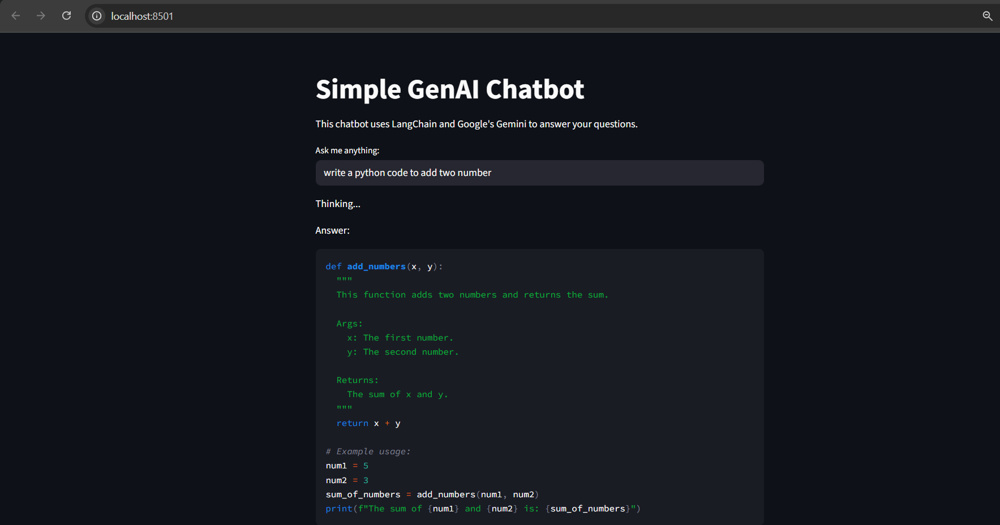

# Simple GenAI Chatbot with LangChain and Streamlit

This project is a simple, web-based chatbot built using Python. It leverages the power of Google's Gemini model through the LangChain framework and provides an interactive user interface with Streamlit.

## Features

-   **Interactive UI**: A clean and simple web interface built with Streamlit.
-   **Powered by Gemini**: Utilizes Google's powerful `gemini-2.0-flash-lite` model for generating responses.
-   **LangChain Integration**: Built on the LangChain framework to structure the interaction with the language model.
-   **Secure API Key Handling**: Uses a `.env` file to securely manage the Google API key, keeping it out of the version control.

## Demo



## Tech Stack

-   **Backend**: Python
-   **LLM Framework**: LangChain
-   **LLM Provider**: Google Gemini
-   **Frontend**: Streamlit
-   **Environment Variables**: `python-dotenv`

## Setup and Installation

Follow these steps to get the application running on your local machine.

### 1. Clone the Repository

```bash
git clone https://github.com/your-username/your-repository-name.git
cd your-repository-name
```

### 2. Create a Virtual Environment

It is highly recommended to use a virtual environment to keep project dependencies isolated.

```bash
# For Windows
python -m venv venv
venv\Scripts\activate
```

### 3. Install Dependencies

Install all the required Python packages using the `requirements.txt` file.

```bash
pip install -r requirements.txt
```

### 4. Set Up Your Environment Variables

This project requires a Google API key to interact with the Gemini model.

1.  Create a new file named `.env` in the root directory of the project.
2.  Open the `.env` file and add your Google API key in the following format:

    ```
    GOOGLE_API_KEY="YOUR_GOOGLE_API_KEY_HERE"
    ```

    Replace `"YOUR_GOOGLE_API_KEY_HERE"` with your actual API key.


## How to Run the Application

Once you have completed the setup, you can run the Streamlit application with the following command in your terminal:

```bash
streamlit run app.py
```

Your web browser should automatically open a new tab with the chatbot interface. If not, the terminal will provide a local URL (e.g., `http://localhost:8501`) that you can navigate to.

